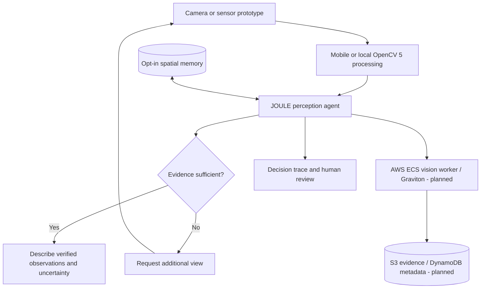

# Proposed architecture (not yet deployed)

```mermaid
flowchart TD
  A[Camera or sensor prototype] --> B[Mobile or local OpenCV 5 processing]
  B --> C[JOULE perception agent]
  D[(Opt-in spatial memory)] <--> C
  C --> E{Evidence sufficient?}
  E -->|No| F[Request additional view]
  F --> A
  E -->|Yes| G[Describe verified observations and uncertainty]
  C --> H[AWS ECS vision worker / Graviton - planned]
  H --> I[(S3 evidence / DynamoDB metadata - planned)]
  C --> J[Decision trace and human review]
```
COOL on ARM is optional and must be benchmarked before claiming it.
